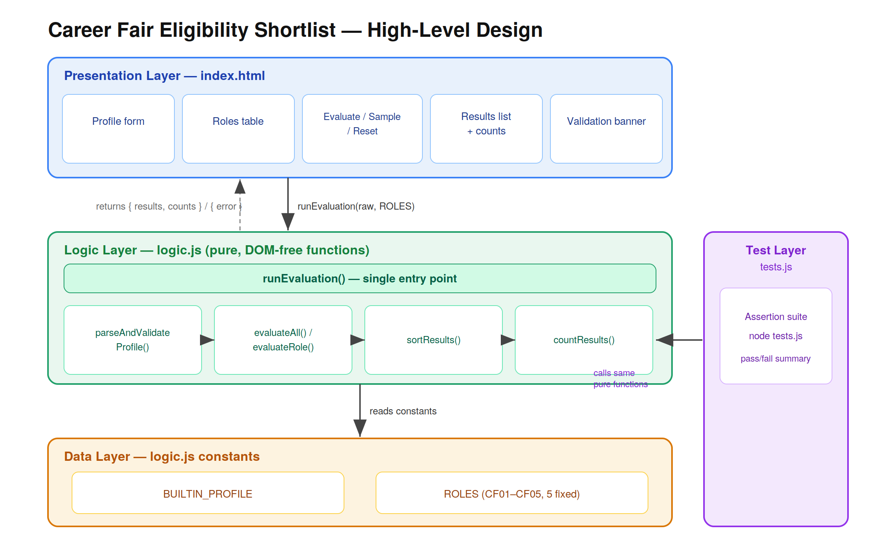

# Career Fair Eligibility Shortlist

A compact, offline tool for a university placement team. It compares one student's academic
profile against a fixed set of career-fair roles and shows which roles the student is eligible
for — and, for every ineligible role, exactly which rules failed.

## Tech Stack

Vanilla **HTML + CSS + JavaScript** — no framework, no build step, no dependencies.

| File | Responsibility |
|------|----------------|
| `logic.js` | Pure functions only — validation, eligibility evaluation, ordering. No DOM access. |
| `index.html` | The single-page UI (profile form, roles table, results, counts, validation banner) + styling. |
| `tests.js` | Assertion-based test suite over `logic.js`. Run with `node tests.js`. |

**Why this stack:**
- The problem is small and fully offline, so a framework would add layers we'd have to justify
  against a spec that explicitly warns against over-engineering.
- No build step → instant startup and refresh, which keeps live modification friction-free.
- Pure logic separated from the DOM → the same functions power both the UI and the tests, which
  is what makes test-driven development possible and live edits low-risk.

## High-Level Design

The app is organized into four layers, with one strict rule: **all decision logic is pure and
DOM-free**, so the UI and the tests call the exact same functions.

- **Presentation layer (`index.html`)** — profile form, roles reference table, Evaluate / Sample /
  Reset controls, results list + counts, and a validation banner.
- **Logic layer (`logic.js`)** — a single entry point, `runEvaluation()`, orchestrates
  `parseAndValidateProfile` → `evaluateAll` / `evaluateRole` → `sortResults` → `countResults`.
- **Data layer (`logic.js` constants)** — `BUILTIN_PROFILE` and the five fixed roles (`ROLES`),
  stored as data so roles can be added or removed without touching the logic.
- **Test layer (`tests.js`)** — an assertion suite that exercises the logic layer directly and
  prints a pass/fail summary.
